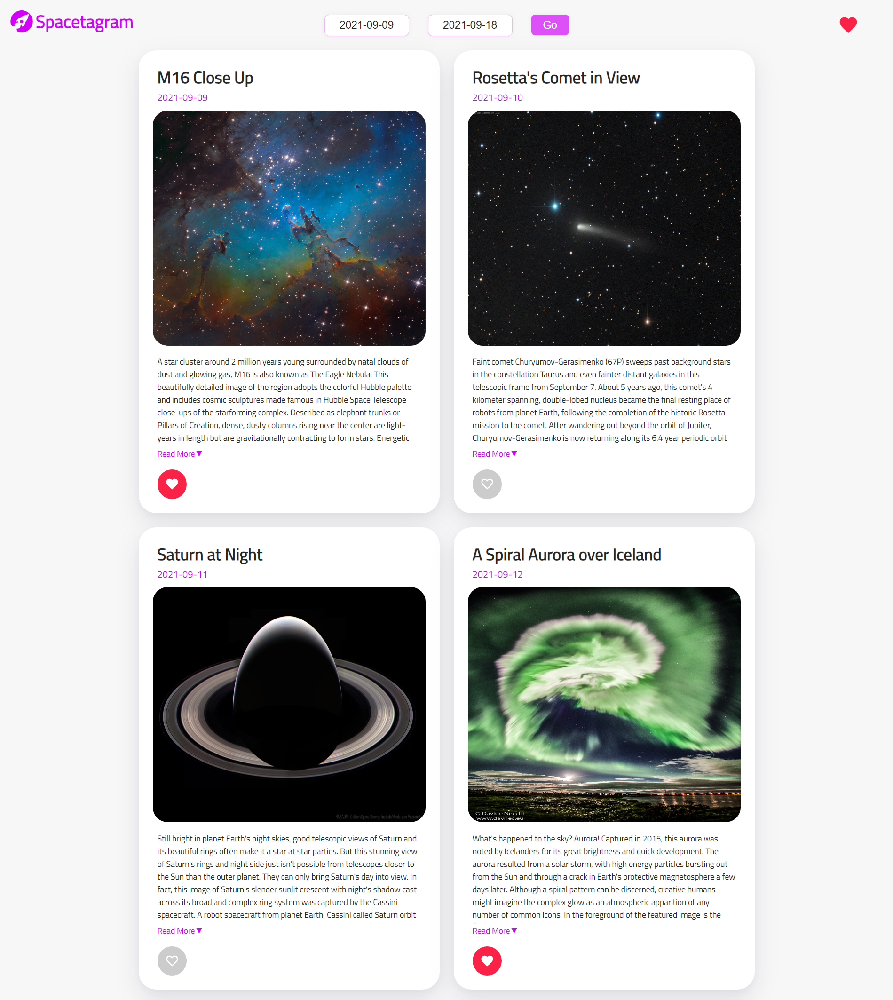
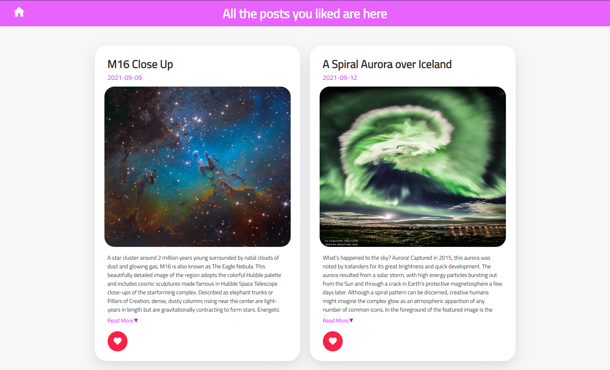

# Spacetagram

- [Live](http://spacetagram-sukhseerat-kaur.netlify.app)

## About the app

- This app uses the **[NASA API - APOD (Astronomy Picture Of the Day)](https://api.nasa.gov/)** to get the data.
- There are 2 date pickers: one for the Start Date and the other for the End Date. The user can pick the date range for which he wants to view the Astronomy Picture Of the Day.
- Each post shows the image along with the title, date and description of the image.
- The user can like and unlike the image post, which get saved in the local storage, hence the posts remain liked even after the user visits again.

- There is also a **dedicated page for the liked image posts**, where the user can view all the images that he liked.

